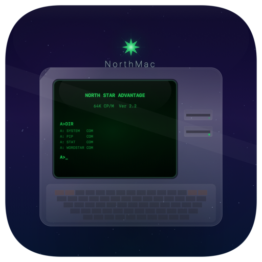

# NorthMac

A NorthStar Advantage (circa 1982) emulator for macOS, built with SwiftUI and Metal.



## What It Does

NorthMac emulates the NorthStar Advantage Z80-based microcomputer — an all-in-one machine with a built-in CRT, dual 5.25" floppy drives, and a bitmap graphics display. The emulator boots real CP/M disk images and runs vintage software.

### Features

- **Full Z80 CPU** emulation via C core (z80.c/z80.h)
- **256KB memory** with bank switching (4 x 16KB mapping registers)
- **Metal CRT shader** with scanlines, phosphor bloom, barrel distortion, and phosphor persistence
- **Green, Amber, and White** phosphor colors
- **Floppy disk controller** state machine supporting 175KB and 350KB NSI images
- **Hard disk controller** supporting NHD images
- **Keyboard input** via macOS key events mapped to NorthStar scan codes
- **Audio** with programmable speaker emulation
- **Turbo mode** (Cmd+T) for maximum speed
- **Screenshots** (Cmd+S) saved to Desktop like macOS Finder

### What Boots

CP/M 1.2 and 2.2 disk images built for the Advantage platform boot successfully, including:
advf2, system_flp, CPM Master, CPMBASIC, WORDSTAR, WordstarG, DataStar, SMALLC, FML80, NSCS58, NSCS61, DEMODIAG, and more.

Note: NorthStar **Horizon** disk images (N2212_64, N22A_56, etc.) are for different hardware and will not boot.

## Building

Requires Xcode 15+ and macOS 14+.

1. Clone this repo
2. Open `NorthMac.xcodeproj` in Xcode
3. Build and run (Cmd+R)

### Disk Images & Boot ROM

Disk images (`.NSI`, `.NHD`) and the boot ROM (`AdvantageBootRom.bin`) are **not included** for copyright reasons.

- Place the Advantage Boot ROM as `NorthMac/Resources/AdvantageBootRom.bin`
- Place floppy disk images in `NorthMac/Disk Images/Bootable/`
- Place hard disk images in `NorthMac/Hard Disks/`

These can be found in various vintage computing archives and preservation sites.

## Keyboard Shortcuts

| Shortcut | Action |
|----------|--------|
| Cmd+P | Pause / Resume |
| Cmd+T | Toggle Turbo Mode |
| Cmd+Shift+R | Reset (cold boot) |
| Cmd+S | Save Screenshot |

## Architecture

```
NorthMac/
  NorthMacApp.swift           -- SwiftUI App entry
  ContentView.swift           -- Main window with display + toolbar
  Core/
    EmulatorCore.swift        -- Z80 run loop, timing, lifecycle
    MemorySystem.swift        -- 256KB RAM + bank switching
    IOSystem.swift            -- I/O port dispatch
    FloppyDiskController.swift -- FDC state machine + NSI I/O
    HardDiskController.swift  -- HDC emulation + NHD I/O
    DisplaySystem.swift       -- Video RAM rendering
    KeyboardSystem.swift      -- macOS key -> Advantage key mapping
    AudioSystem.swift         -- Speaker emulation
  Views/
    MetalDisplayView.swift    -- MTKView + CRT fragment shader
  Models/
    DiskImage.swift           -- NSI format detection + validation
  Bridge/
    z80-bridge.h              -- C bridging header
  z80.c / z80.h               -- Z80 CPU core (C)
```

## Acknowledgments

The Z80 CPU core is based on [superzazu/z80](https://github.com/superzazu/z80), a clean open-source Z80 emulator in C.

The [ADE emulator](https://github.com/jblang/ade) by Jon Lang (based on earlier work) served as an invaluable reference for the NorthStar Advantage I/O architecture, FDC state machine, and memory mapping behavior.

## License

MIT

---

*Dedicated to the memory of Stephen Troy, whose NorthStar Advantage was one of my first computers. Thanks, Dad.*
