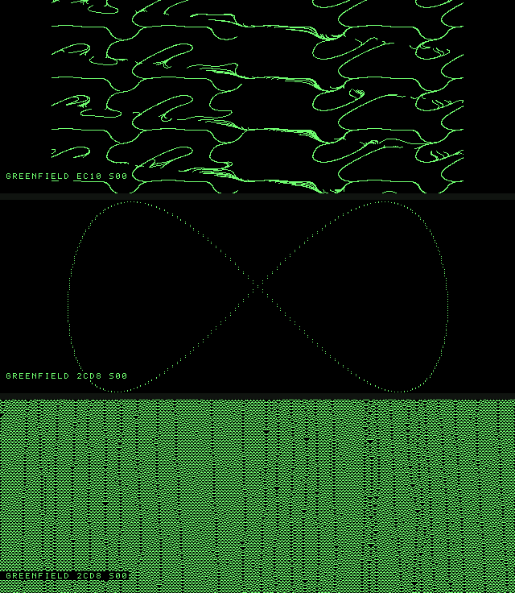

# GREENFIELD

A purpose-built **generative-art operating system** for the 1982 NorthStar
Advantage — no CP/M, no DOS, no legacy. It boots straight off a floppy under
the machine's *stock* boot PROM, takes over the bare metal, and turns the
Advantage into a living, interactive generative-art gallery.

It rotates through **thirteen** generative modes, each seeded from the Z80
refresh register so every canvas is one-of-a-kind. Each finished piece **sings**
a seed-derived chime and is **signed** with its title and hex seed (an edition
you can reproduce). You **drive** it from the keyboard, including a software
speed brake.

The modes: domain-warped **flow field** · **Lissajous/harmonograph** · scrolling
**cellular automaton** · Sierpinski **chaos game** · **phyllotaxis** · **rose**
curve · **Truchet** tiles · Brownian **walk** · multiplication-table **moiré** ·
**plasma** field · wave **ripples** · the **Mandelbrot** set · Conway's **Game
of Life**.

It runs identically on the **NorthMac emulator** and on **real NorthStar
Advantage hardware** (written to a hard-sectored disk via Greaseweazle).

## Two stages

The PROM only auto-loads 2 KB, but the OS is now ~3.4 KB. So GREENFIELD is in
two parts, both on the disk: **stage 1** (the loader, the 2 KB the PROM reads to
`0xC100`) seeks to track 1 and reads stage 2's 5 KB into `0x8000` using the
PROM's own FDC protocol (sector-mark sync, acquire-toggle, serial-data wait,
514-byte transfer per sector), then jumps to it. **Stage 2** is the art — all
thirteen modes — running from a RAM bank with the framebuffer mapped at
`0x0000`/`0x4000` and data/stack in page-3 RAM.

## Controls (keyboard)

| Key | Action |
|-----|--------|
| `SPACE` | new canvas (same mode) |
| `0`–`9` | jump to mode 0–9 (the gallery auto-rotates through all 13) |
| `P` | pause / resume |
| `+` / `-` | faster / slower (software speed brake) |

**Speed.** The emulator's turbo (`⌘T`) is a host-side, on/off throttle that a
bare-metal Z80 program can neither read nor set, so GREENFIELD paces *itself*:
`pacedly` burns a tunable number of cycles between work units. Run NorthMac in
**turbo** for headroom and dial the visual speed with `+` / `-` — the current
level shows in the signature as `Snn`. In native 4 MHz mode, press `+` down to
`S00` (no brake) for full speed.



*Three consecutive canvases from one boot — each a unique domain-warped flow
field. Rendered pixel-exact from the real z80 core's video RAM.*

## Target hardware

- **64 KB NorthStar Advantage.** GREENFIELD uses only main-RAM bank 3 (its
  code, variables, and stack all live in `0xC000`–`0xFFFF`) plus the dedicated
  bit-mapped video RAM (banks 8/9). It maps a scratch page at `0x8000` but
  doesn't yet need it. Comfortably inside a base 64 KB machine.
- **One 360 KB drive.** `greenfield.nsi` is the NorthStar DSDD format
  (35 trk × 2 sides × 10 sec × 512 = 358,400 bytes), the same format shipping
  Advantage disks use — colloquially "360K." Boots from the first drive.
- **Two-stage.** The OS outgrew the PROM's 2 KB single-load window, so stage 1
  (the loader) pulls stage 2 off track 1. Stage 2 is ~3.4 KB of 5 KB read; lots
  of headroom remains, and the loader can be extended to read further tracks
  (or a second drive) for still more.

## Why this is interesting

The Advantage's video is a **640×240 (×256 scanned) 1-bit framebuffer** living
in two 16 KB banks of dedicated video RAM, laid out **column-major**: the byte
for byte-column `c` (0–79) and scanline `y` (0–255) is at `c*256 + y`, and
within a byte **bit 7 is the leftmost** of 8 horizontal pixels. GREENFIELD maps
both video banks live into the Z80 address space (`0x0000`/`0x4000`), so a
pixel plot is just an `OR` into `(col<<8)|scan`. The flow field is computed with
a single 256-entry signed sine table and a 16-bit Galois LFSR (seeded from the
Z80 refresh register `R`) — no multiply, no floating point. The whole OS is
~600 bytes.

## Boot contract (how it rides the stock PROM)

The reason this works on unmodified hardware is that GREENFIELD obeys the exact
protocol the Advantage's 2 KB boot PROM uses to load a system, reverse-engineered
from the PROM disassembly and verified byte-for-byte against shipping Advantage
system disks:

1. The PROM seeks track 0, syncs on sector 3, then reads the **next four
   512-byte sectors** (track 0 sectors 4–7 = **file offset `0x800`–`0xFFF`,
   2 KB**) into RAM at `load_page:0000`.
2. The **first byte read becomes the high byte of the load address**, so image
   byte `0x00` *must* equal the load page. GREENFIELD uses `0xC1` → loads at
   `0xC100`.
3. After loading, the PROM computes `HL = 0xF80A + DE` which (with exactly
   `0x800` bytes read) wraps to `load_page:000A`. It verifies the byte there is
   `0xC3` (a `JP` opcode) and does `JP (HL)`. So image byte `0x0A` *must* be a
   `JP`, and that's GREENFIELD's entry.

`mkdisk.py` enforces all three invariants before it will write a disk.

## Build

Requires [`z80asm`](https://www.nongnu.org/z80asm/) (`brew install z80asm`) and
`python3`.

```sh
./build.sh          # -> greenfield.bin, greenfield.nsi (350 KB DSDD)
```

## Run on the emulator

```sh
# from the NorthMac project root
bin/northmac --auto-enter greenfield/greenfield.nsi
```

`--auto-enter` presses RETURN at the `LOAD SYSTEM` prompt for you. Or launch
NorthMac normally, `File ▸ Open` the disk into a drive, and press **RETURN** at
`LOAD SYSTEM`. You'll see ~15 s of the canvas painting, a pause to admire it,
then it clears and dreams up the next one.

```sh
./build.sh run      # build + boot it for you
```

## Verify headlessly (no GUI)

`test/run_gf.c` boots a payload on the **real NorthMac z80 core** (`z80.c`),
replicating the PROM-exit memory map and the bank-mapping write-guard, then
dumps the framebuffer. `test/render_fb.py` decodes it to PNG *exactly* as the
Metal shader does (column-major, bit 7 = leftmost), so the render is pixel-exact
to what the CRT shows.

```sh
./build.sh test     # -> test/greenfield.png
```

## Write to a real NorthStar Advantage disk (Greaseweazle)

The Advantage uses **hard-sectored** 5.25″ disks (10 sector holes + index), so
the write **must** pass `--hard-sectors` — without it Greaseweazle lays down one
continuous track terminating at the single index, which is both wrong for the
media and starves the flux buffer (underflow). The right command:

```sh
gw write --hard-sectors --format northstar.mfm.ds greenfield.nsi
```

Notes from a real write (Greaseweazle V4.1, AT32F403A → USB Full Speed, which is
normal for that MCU):
- Add `--drive b` (or `--drive 1`) if your NorthStar drive is jumpered as unit 1
  — symptom of the wrong unit is `No Index` (the motor never spins).
- `Track0 signal absent` → run `gw reset` to re-home the head, then retry.
- `--hard-sectors` is what cleared the `Flux Underflow` here; it writes per
  sector hole instead of one 200 ms burst.

Put the written disk in the Advantage, power on, press RETURN at `LOAD SYSTEM`.
No ROM swap, no other software required.

## Files

| File | Purpose |
|------|---------|
| `stage1.asm`        | the loader (PROM boot payload at 0xC100; FDC read of stage 2) |
| `greenfield.asm`    | stage 2 — the art: memory/display setup + all 13 modes (org 0x8000) |
| `gen_sintab.py`     | emits `sintab.inc` (256-entry signed sine table) |
| `gen_font.py`       | emits `font.inc` (5×7 font for the signature) |
| `mkdisk.py`         | packs stage 1 (track 0) + stage 2 (track 1) into a 350 KB DSDD `.nsi` |
| `build.sh`          | assemble both stages · build disk · `run` / `test` / `scp` |
| `test/run_gf.c`     | headless harness (real `z80.c`) — runs stage 2 directly for mode work |
| `test/run_loader.c` | verifies stage 1 against a port of `FloppyDiskController` |
| `test/render_fb.py` | framebuffer → PNG, decoded as the Metal shader does |

## Tuning

In `greenfield.asm`: the default speed brake (`ld a,8` into `paceLvl` at
`seeded`), `STEPS` (flow trail length), the `caRules` table (which CA rules are
in rotation), `NMODES` (gallery rotation length), and the `hold` duration. The
`>>6` field frequency (`add hl,hl` pairs in `step`) and warp strength (`sra a`)
shape the flow field; `lfreq` sets the Lissajous ratios. Want a single mode
instead of the rotation? Pin `mode` in `seeded` and skip the advance in `gact`.
